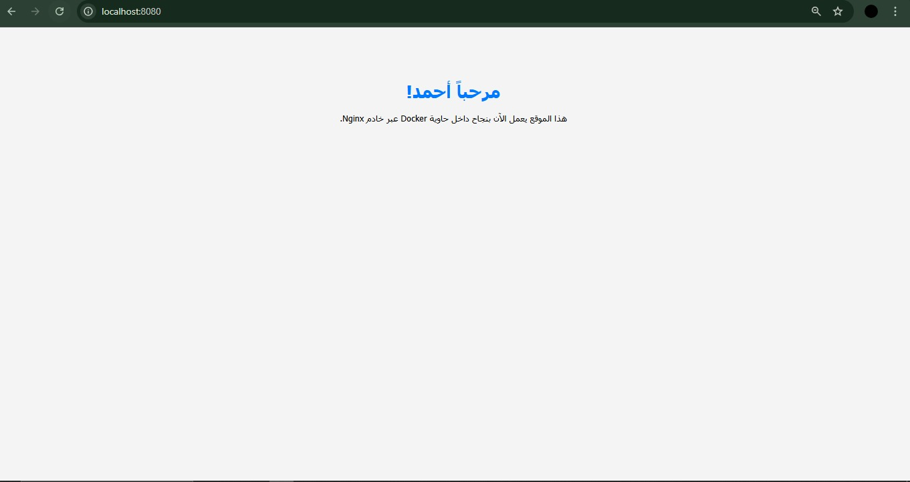
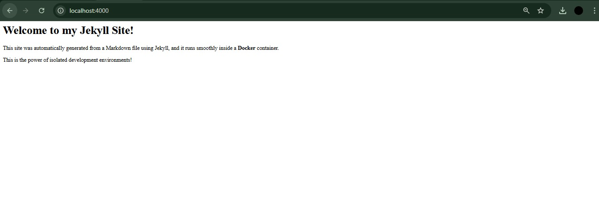
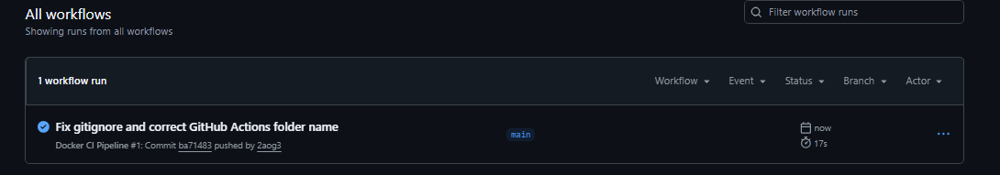
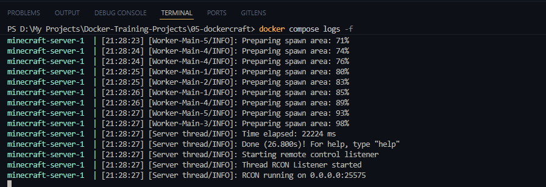
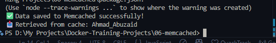
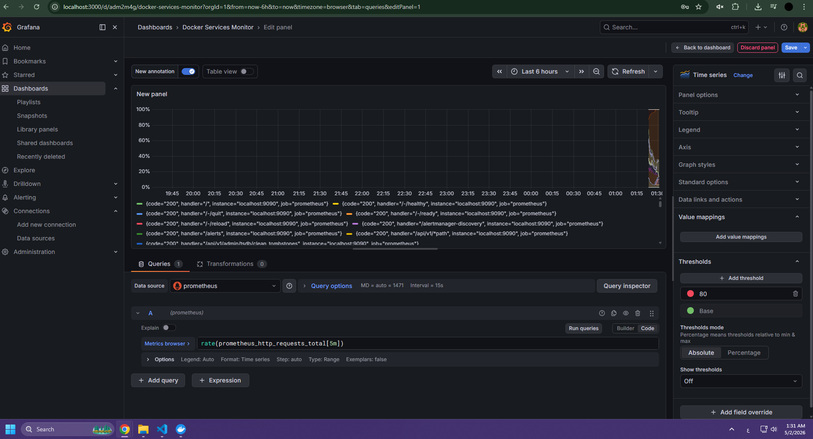
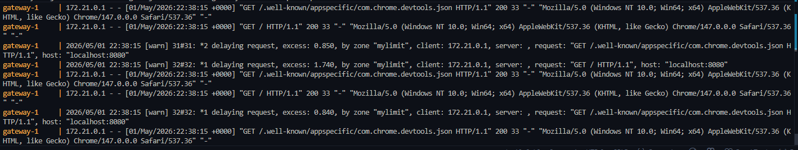

<div align="center">

# Docker Mastery: 10-Project Challenge

**Ahmad Oglah Abuzaid**

Computer Science Student at the German Jordanian University (GJU)

Backend Developer Intern at Artl Studio

Interests: Cybersecurity, Secure Backend Systems, Cloud-Native Infrastructure

[](#)
[](#)
[](#)
[](#)
[](#)
[](#)
[](#)

</div>

---

## About This Repository

This repo is my hands-on journey through Docker and container orchestration. I started from the very basics (serving a simple HTML page) and worked my way up to running virtual machines inside Kubernetes. Each project taught me something new, and they all build on top of each other.

This challenge is inspired by the [Top 10 Docker Projects for Beginners](https://www.geeksforgeeks.org/blogs/docker-projects-ideas-for-beginners/) article on GeeksForGeeks. I followed the original list for projects 01 to 06 and project 08. For the remaining three (07, 09, and 10), I swapped the suggested projects for better alternatives that are more practical and closer to my interests in security and backend systems. Here is what I changed and why:

| # | Original Project (GFG) | What I Built Instead | Why I Changed It |
|---|------------------------|----------------------|------------------|
| 07 | RancherVM | Nginx Load Balancer | RancherVM is outdated and barely maintained anymore. An Nginx load balancer is something you will actually use in real projects. |
| 09 | Dokku | Prometheus + Grafana | Dokku is not widely used. Prometheus and Grafana are the standard tools for monitoring in almost every company. |
| 10 | Passenger Docker | Secure Gateway with Rate Limiting | Passenger Docker is just a deployment helper with nothing interesting to learn. Rate limiting is a real security concept that I wanted to implement myself. |

---

## Table of Contents

| # | Project | Key Technology |
|---|---------|----------------|
| 01 | [Static Website with Nginx](#01---static-website-with-nginx) | Docker, Nginx |
| 02 | [Jekyll Static Site Generator](#02---jekyll-static-site-generator) | Docker, Jekyll |
| 03 | [Node.js + MongoDB with Docker Compose](#03---nodejs--mongodb-with-docker-compose) | Docker Compose, Express, MongoDB |
| 04 | [CI/CD with GitHub Actions](#04---cicd-with-github-actions) | GitHub Actions, Docker Build |
| 05 | [Minecraft Server (Dockercraft)](#05---minecraft-server-dockercraft) | Docker, itzg/minecraft-server |
| 06 | [Custom Memcached Image](#06---custom-memcached-image) | Docker, Memcached |
| 07 | [Nginx Load Balancer](#07---nginx-load-balancer) | Docker Compose, Nginx Upstream |
| 08 | [KubeVirt Virtual Machine](#08---kubevirt-virtual-machine) | Kubernetes, KubeVirt |
| 09 | [Prometheus and Grafana Monitoring](#09---prometheus-and-grafana-monitoring) | Docker Compose, Prometheus, Grafana |
| 10 | [Secure Gateway with Rate Limiting](#10---secure-gateway-with-rate-limiting) | Nginx, Rate Limiting, Security |

---

## 01 - Static Website with Nginx

<p align="center">
  
</p>

### What is this project about?

The idea here is simple: instead of installing Nginx on your computer to serve a website, you put everything inside a Docker container. The container has Nginx already set up, and you just drop your HTML file into it. That is it.

### How it works

```dockerfile
FROM nginx:alpine
COPY index.html /usr/share/nginx/html/index.html
```

This Dockerfile has only two lines. The first line says "use the Nginx image built on Alpine Linux" (Alpine is a very lightweight Linux, so the final image is only about 25 MB). The second line copies the HTML file into the folder where Nginx looks for files to serve.

The HTML page I made is in Arabic (right-to-left layout), which also tests that the server handles Arabic text and UTF-8 encoding correctly.

**What I learned:**
- How to write a basic Dockerfile
- What image layers mean (each line in the Dockerfile is a layer)
- Why containers are better than installing software directly on your machine

### What happened when I ran it

The website showed up at `localhost:8080` right away. No Nginx installation on my machine, no setup steps. Just build the image and run the container.

```bash
cd 01-static-website
docker build -t my-static-website .
docker run -d -p 8080:80 my-static-website
```

---

## 02 - Jekyll Static Site Generator

<p align="center">
  
</p>

### What is this project about?

Jekyll is a tool that turns Markdown files into full websites. Normally, to use Jekyll you need to install Ruby and a bunch of other dependencies on your computer, and that process is painful and different on every OS. With Docker, you just use an image that already has everything installed.

### How it works

```dockerfile
FROM jekyll/jekyll:minimal
WORKDIR /srv/jekyll
COPY . .
CMD ["jekyll", "serve", "--force_polling", "-H", "0.0.0.0", "-P", "4000"]
```

The `jekyll/jekyll:minimal` image comes with Ruby and Jekyll ready to go. The `WORKDIR` sets the folder Jekyll expects to work in. The `--force_polling` flag is needed because Docker on some systems does not pick up file changes the normal way, so polling is a workaround to make live reload work. The `-H 0.0.0.0` part is important too: without it, Jekyll only listens inside the container and you cannot reach it from your browser.

The site config:

```yaml
# _config.yml
title: My Docker Jekyll Site
description: Learning Docker step by step!
```

**What I learned:**
- Using Docker as a development environment, not just a server
- Why `-H 0.0.0.0` matters when working with containers
- How containers can replace local tool installations completely

### What happened when I ran it

Jekyll started on port 4000 and converted the `index.md` Markdown file into a proper HTML page. Any edit to the file triggered an automatic rebuild inside the container.

```bash
cd 02-jekyll-jam
docker build -t my-jekyll-site .
docker run -d -p 4000:4000 my-jekyll-site
```

---

## 03 - Node.js + MongoDB with Docker Compose

<p align="center">
  
</p>

### What is this project about?

This is the first project where two containers need to talk to each other: a Node.js backend API and a MongoDB database. Docker Compose makes this easy by letting you define both services in one file and connecting them automatically.

### How it works

```yaml
# docker-compose.yml
version: '3.8'
services:
  app:
    build: .
    ports:
      - "5000:5000"
    environment:
      - PORT=5000
      - MONGO_URI=${MONGO_URI}
    depends_on:
      - mongo

  mongo:
    image: mongo:latest
    ports:
      - "27017:27017"
```

```dockerfile
FROM node:20-alpine
WORKDIR /app
COPY package.json ./
RUN npm install
COPY . .
EXPOSE 5000
CMD ["npm", "start"]
```

When Docker Compose starts, it creates a private network between the two containers. The `app` service can reach MongoDB just by using the name `mongo` as the hostname. You do not need to know any IP address. The `depends_on` option makes sure MongoDB starts first, because the app tries to connect to the database as soon as it boots.

One small but important thing: `package.json` is copied and `npm install` runs *before* the rest of the code is copied. This is a caching trick. If you only change your application code, Docker skips reinstalling all the packages and uses the cached version instead, which makes rebuilds much faster.

**What I learned:**
- How Docker Compose links multiple containers together
- How containers find each other by name (DNS inside Docker)
- How to inject environment variables into a container
- The Dockerfile caching trick for faster builds

### What happened when I ran it

One command started everything. The app logged `MongoDB connected` and the API responded at `localhost:5000`. MongoDB never needed to be installed on my machine.

```bash
cd 03-docker-compose
docker compose up -d --build
```

---

## 04 - CI/CD with GitHub Actions

<p align="center">
  
</p>

### What is this project about?

The goal here is to automate the Docker build process. Every time I push code to GitHub, a pipeline automatically builds the Docker image and checks that it works. This way, if something breaks the build, I find out immediately instead of discovering it later in production.

### How it works

```yaml
# .github/workflows/docker-ci.yml
name: Docker CI Pipeline

on:
  push:
    branches: ["main", "master"]

jobs:
  build-and-test:
    runs-on: ubuntu-latest
    steps:
      - name: Checkout Code
        uses: actions/checkout@v3

      - name: Build Docker Image
        run: |
          cd 03-docker-compose
          docker build -t test-node-app .

      - name: List Docker Images
        run: docker images
```

The workflow file lives inside `.github/workflows/`. GitHub reads it automatically. Whenever I push to `main` or `master`, GitHub spins up a fresh Ubuntu machine with Docker already installed, checks out the code, and runs `docker build`. If the build fails for any reason (bad Dockerfile, missing file, broken dependency), the pipeline turns red and I get notified.

**What I learned:**
- How to write a GitHub Actions workflow
- How to automate Docker builds in CI
- Why catching broken builds early matters

### What happened when I ran it

Every push triggered the pipeline. The GitHub Actions tab showed a green checkmark when the build passed, which means the image builds cleanly from a fresh machine, not just on my laptop.

---

## 05 - Minecraft Server (Dockercraft)

<p align="center">
  
</p>

### What is this project about?

This project shows that Docker is not just for web applications. A full Minecraft Java Edition server with version pinning, EULA acceptance, and memory limits, configured entirely through environment variables in a compose file.

### How it works

```yaml
# docker-compose.yml
version: "3.8"
services:
  minecraft-server:
    image: itzg/minecraft-server
    ports:
      - "25565:25565"
    environment:
      EULA: "TRUE"
      VERSION: "1.20.4"
      MEMORY: "4G"
    tty: true
    stdin_open: true
```

The `itzg/minecraft-server` image handles everything: it downloads the correct server version, accepts the EULA, applies the memory settings, and starts the Java process. Setting `VERSION: "1.20.4"` pins the server to a specific version so it is always reproducible. The `MEMORY: "4G"` flag passes `-Xmx4G -Xms4G` to Java under the hood. `tty: true` and `stdin_open: true` keep the server terminal interactive so you can type server commands.

Port 25565 is the default Minecraft port. Any Minecraft client can connect to `localhost:25565` directly.

**What I learned:**
- How to run non-web applications (TCP game servers) in Docker
- How to configure complex software using only environment variables
- How to keep containers interactive with TTY

### What happened when I ran it

The server booted, printed `Done!` in the logs, and was ready to accept connections. A working Minecraft server, deployed in seconds, with no Java installation required.

```bash
cd 05-dockercraft
docker compose up -d
```

---

## 06 - Custom Memcached Image

<p align="center">
  
</p>

### What is this project about?

Memcached is a fast in-memory cache. You could just run `docker run memcached` directly, but this project is about building your own custom image on top of an official one. This is a skill you need whenever you want to add your own configuration, scripts, or startup logic to an existing tool.

### How it works

```dockerfile
FROM memcached:alpine
EXPOSE 11211
CMD ["memcached"]
```

The base image is `memcached:alpine`, which keeps things small. `EXPOSE 11211` documents that this container uses port 11211, the standard Memcached port. `CMD ["memcached"]` starts the Memcached process in the foreground. This is important: if you run it in the background, the container has no main process and shuts down immediately. Containers stay alive as long as their main process is running.

If you needed to limit memory usage later, you could change the CMD to `["memcached", "-m", "512"]` and it would cap at 512 MB.

**What I learned:**
- How to extend official images with a custom Dockerfile
- Why `EXPOSE` is useful for documentation
- How foreground vs background processes affect container lifetime

### What happened when I ran it

The custom image built and started cleanly. Memcached was reachable on port 11211 and responded to cache get/set commands.

```bash
cd 06-memcached
docker build -t my-memcached .
docker run -d -p 11211:11211 my-memcached
```

---

## 07 - Nginx Load Balancer

> **Replaced from original list:** The GeeksForGeeks article suggested **RancherVM** for this slot (running VMs as Docker containers using Rancher). RancherVM is no longer actively maintained and does not work well with modern Kubernetes setups. I replaced it with an Nginx load balancer, which is something you will actually encounter in real backend and DevOps work.

<p align="center">
  
</p>

### What is this project about?

Instead of running one copy of an application, this project runs three identical copies and puts Nginx in front of them. Nginx decides which copy handles each incoming request. This is called load balancing, and it is one of the most common patterns in any backend system that needs to handle more users.

### How it works

```yaml
# docker-compose.yml
version: "3.8"
services:
  app1:
    build: .
  app2:
    build: .
  app3:
    build: .

  nginx:
    image: nginx:alpine
    ports:
      - "8080:80"
    volumes:
      - ./nginx.conf:/etc/nginx/nginx.conf:ro
    depends_on:
      - app1
      - app2
      - app3
```

```nginx
# nginx.conf
events {}

http {
    upstream node_cluster {
        server app1:3000;
        server app2:3000;
        server app3:3000;
    }

    server {
        listen 80;
        location / {
            proxy_pass http://node_cluster;
        }
    }
}
```

The `upstream` block in Nginx defines a group of three servers called `node_cluster`. By default, Nginx uses round-robin: request 1 goes to `app1`, request 2 goes to `app2`, request 3 goes to `app3`, then it starts over. The three container names (`app1`, `app2`, `app3`) are resolved automatically by Docker's internal DNS. The config file is mounted as read-only (`:ro`) so nothing inside the container can accidentally change it.

**What I learned:**
- How Nginx upstream blocks work
- How round-robin load balancing distributes traffic
- How Docker's internal DNS lets containers find each other by name
- Read-only volume mounts

### What happened when I ran it

Every time I hit `localhost:8080`, a different container handled the request. I could see this in the logs because each container printed its own message. The traffic was splitting evenly across all three.

```bash
cd 07-load-balancer
docker compose up --build
```

---

## 08 - KubeVirt Virtual Machine

<p align="center">
  
</p>

### What is this project about?

This project goes beyond Docker into Kubernetes. KubeVirt is a Kubernetes extension that lets you run real Virtual Machines alongside your containers, all managed with the same `kubectl` commands you use for everything else. I deployed a VM called `ahmad-sentinel-vm` as a step toward building security-focused infrastructure.

### How it works

```yaml
# vm.yaml
apiVersion: kubevirt.io/v1
kind: VirtualMachine
metadata:
  name: ahmad-sentinel-vm
spec:
  running: true
  template:
    spec:
      domain:
        devices:
          disks:
            - name: containerdisk
              disk:
                bus: virtio
        resources:
          requests:
            memory: 128M
      volumes:
        - name: containerdisk
          containerDisk:
            image: quay.io/kubevirt/cirros-container-disk-demo
```

This is a Kubernetes YAML manifest. Instead of creating a Pod or Deployment (which runs containers), it creates a `VirtualMachine` object, which KubeVirt knows how to handle. The `running: true` field tells KubeVirt to start the VM immediately. The disk is a `containerDisk`, which is a container image that holds a raw disk file inside it. The VM boots from that disk. The `virtio` bus is the fast, paravirtualized disk driver used for KVM virtual machines. The OS inside is CirOS, a tiny Linux image made for cloud testing.

**Why the name `ahmad-sentinel-vm`?**

A sentinel is a guard that watches and monitors. In security, you often need isolated environments to run tools like network scanners, honeypots, or intrusion detection systems without putting those tools directly on a shared host. This VM is a starting point for that idea. It connects my containerization skills to my interest in building security-focused infrastructure.

**What I learned:**
- How Kubernetes custom resources (CRDs) extend what Kubernetes can do
- How KubeVirt manages VM lifecycle inside a cluster
- How ContainerDisk volumes work
- How VMs and containers can live in the same cluster

### What happened when I ran it

The VM object was created in the cluster. KubeVirt launched it as a pod behind the scenes (`virt-launcher-ahmad-sentinel-vm-*`), booted CirOS, and the VM reached a `Running` state. A real virtual machine, managed with `kubectl`.

```bash
kubectl apply -f vm.yaml
kubectl get vm
kubectl get vmi
```

---

## 09 - Prometheus and Grafana Monitoring

> **Replaced from original list:** The GeeksForGeeks article suggested **Dokku** for this slot (a self-hosted platform for deploying apps with Git push, similar to Heroku). Dokku is not widely used in the industry. I replaced it with Prometheus and Grafana, which are the actual standard tools for monitoring in backend and DevOps work at almost every company.

<p align="center">
  
</p>

### What is this project about?

This project sets up a monitoring stack. Prometheus collects metrics from your services (numbers like request count, response time, memory usage) and stores them. Grafana reads those metrics and shows them as visual dashboards. Together they let you see exactly what is happening inside your system in real time.

### How it works

```yaml
# docker-compose.yml
version: "3.8"
services:
  prometheus:
    image: prom/prometheus
    volumes:
      - ./prometheus.yml:/etc/prometheus/prometheus.yml
    ports:
      - "9090:9090"

  grafana:
    image: grafana/grafana
    ports:
      - "3000:3000"
    depends_on:
      - prometheus
```

```yaml
# prometheus.yml
global:
  scrape_interval: 15s

scrape_configs:
  - job_name: "prometheus"
    static_configs:
      - targets: ["localhost:9090"]
```

Prometheus is told to scrape metrics every 15 seconds. The config file is mounted as a volume so you can change what Prometheus monitors without rebuilding the image. In this setup, Prometheus monitors itself first, which is a simple way to verify the pipeline is working before connecting real applications. Grafana uses `http://prometheus:9090` as its data source. Docker resolves `prometheus` to the correct container automatically.

**What I learned:**
- How Prometheus collects time-series metrics
- How Grafana connects to a data source and builds dashboards
- How to mount config files as volumes
- How to control start order with `depends_on`

### What happened when I ran it

Prometheus started at `localhost:9090` and showed its own metrics in the query browser. Grafana started at `localhost:3000` and after I added Prometheus as a data source, I could build dashboards to visualize the data live.

```bash
cd 09-monitoring
docker compose up -d
# Prometheus: http://localhost:9090
# Grafana:    http://localhost:3000
```

---

## 10 - Secure Gateway with Rate Limiting

> **Replaced from original list:** The GeeksForGeeks article suggested **Passenger Docker** for this slot (a pre-built image for running Ruby, Node.js, and Python apps). It is a convenience wrapper with nothing interesting to learn from a security perspective. I replaced it with a rate-limiting gateway because it directly connects to my interest in cybersecurity and lets me implement a real defense mechanism from scratch.

<p align="center">
  
</p>

### What is this project about?

This project is about security. The idea is simple: your backend API should not be reachable directly from the internet. All traffic has to go through a gateway (Nginx), and that gateway limits how many requests any single IP address can make per second. This protects the API from brute-force attacks, credential stuffing, and request flooding.

### How it works

```yaml
# docker-compose.yml
version: "3.8"
services:
  app_server:
    image: node:18-alpine
    command: >
      sh -c "node -e \"
        const http = require('http');
        http.createServer((req, res) => {
          res.writeHead(200, {'Content-Type': 'text/plain'});
          res.end('Hello from App Server\n');
        }).listen(3000, () => console.log('Server running on port 3000'));
      \""

  gateway:
    image: nginx:alpine
    volumes:
      - ./nginx.conf:/etc/nginx/conf.d/default.conf
    ports:
      - "8080:80"
    depends_on:
      - app_server
```

```nginx
# nginx.conf
limit_req_zone $binary_remote_addr zone=mylimit:10m rate=5r/s;

server {
    listen 80;

    location / {
        limit_req zone=mylimit burst=10;
        proxy_pass http://app_server:3000;
    }
}
```

**Breaking down the rate limiter:**

The `limit_req_zone` line creates a shared memory zone called `mylimit`. It is 10 MB in size, which is enough to track about 160,000 different IP addresses. The rule is: each IP can send a maximum of 5 requests per second. This uses an algorithm called the token bucket: each IP gets a bucket that fills up at 5 tokens per second, and each request uses one token. When the bucket is empty, the request is rejected.

The `burst=10` setting adds a small safety margin. If a user loads a page that needs 8 resources at once, all 8 requests are allowed through without triggering the limit. But if someone sends 50 requests all at once, Nginx stops them and returns `HTTP 503 Service Unavailable`.

Notice that `app_server` has no `ports` entry. It is completely hidden inside the Docker network. The only way to reach it is through the gateway. This is network segmentation at the container level.

**What this defends against:**

| Attack Type | How It Is Blocked |
|-------------|-------------------|
| Brute-force login | Max 5 attempts per second per IP |
| Credential stuffing | Same rate limit stops automated scripts |
| Request flooding / DoS | Burst cap absorbs spikes, rate cap stops the flood |
| Direct backend access | Backend has no exposed port, unreachable from outside |

**What I learned:**
- How Nginx `limit_req_zone` and `limit_req` work
- How the token-bucket algorithm limits traffic
- How to use a reverse proxy as a security layer
- How to isolate a backend service using Docker networking

### What happened when I ran it

Normal requests went through with `200 OK`. When I sent requests faster than 5 per second, Nginx started returning `503` immediately. The backend server never saw the flood at all. It stayed healthy behind the gateway.

```bash
cd 10-secure-gateway
docker compose up -d
# Gateway: http://localhost:8080
```

---

## Skills Covered Across All 10 Projects

| Skill | Projects |
|-------|----------|
| Writing Dockerfiles | 01, 02, 03, 06, 07 |
| Multi-container orchestration with Compose | 03, 07, 09, 10 |
| Nginx (reverse proxy, load balancing, security) | 07, 10 |
| CI/CD pipeline automation | 04 |
| Kubernetes and KubeVirt | 08 |
| Monitoring with Prometheus and Grafana | 09 |
| Security and rate limiting | 10 |
| Environment variable configuration | 03, 05 |
| Lightweight Alpine-based images | 01, 02, 03, 06, 07 |

---

## How to Run Any Project

Every project is self-contained inside its own folder.

```bash
# Projects with a single Dockerfile (01, 02, 06)
docker build -t project-name .
docker run -p <host-port>:<container-port> project-name

# Projects using Docker Compose (03, 05, 07, 09, 10)
docker compose up --build

# Kubernetes project (08)
kubectl apply -f vm.yaml
kubectl get vm
```

---

## About Me

I am Ahmad Oglah Abuzaid, a Computer Science student at the German Jordanian University and a Backend Developer Intern at Artl Studio. My main focus is on cybersecurity and building secure backend systems. I started this challenge to move beyond theory and actually build things with Docker, from the ground up.

[GitHub Profile](https://github.com/Vplo)
